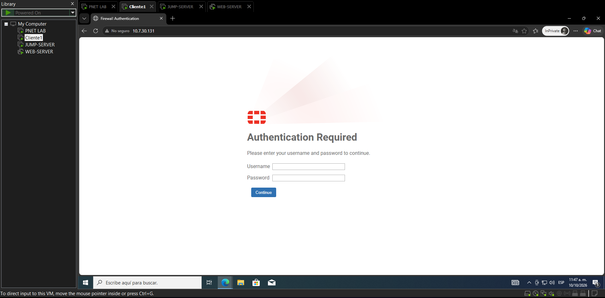

# FortiGate 7.0.3 — VPN de Acceso Remoto (L2TP sobre IPsec), Jump Server y RDS RemoteApp

### Arlene Fernández Herrera · Matrícula: 2025-0730

**Seguridad de Redes · ITLA**

---

## 🎥 Video Demostrativo

**[▶ Ver video de demostración](https://youtu.be/REEMPLAZAR-CON-TU-ID)**

---

> 📚 **Nota:** la página del Web Server (Sistema de Caja) es de demostración y muestra la materia, la institución y el nombre de la estudiante. No es una aplicación de producción. Las contraseñas de este laboratorio son de práctica.

---

## 📋 Tabla de Contenido

1. [Objetivo del Laboratorio](#1-objetivo-del-laboratorio)
2. [Topología y Direccionamiento](#2-topología-y-direccionamiento)
3. [Procedimiento paso a paso](#3-procedimiento-paso-a-paso)
   - [Paso 1. Red pública, redes virtuales y PNETLab](#paso-1-red-pública-redes-virtuales-y-pnetlab)
   - [Paso 2. Switch SW-USUARIOS](#paso-2-switch-sw-usuarios)
   - [Paso 3. Router Cisco: VLAN 10, DHCP y NAT](#paso-3-router-cisco-vlan-10-dhcp-y-nat)
   - [Paso 4. Acceso inicial del FortiGate (CLI)](#paso-4-acceso-inicial-del-fortigate-cli)
   - [Paso 5. Interfaces del FortiGate](#paso-5-interfaces-del-fortigate)
   - [Paso 6. Ruta por defecto y DNS](#paso-6-ruta-por-defecto-y-dns)
   - [Paso 7. Conectividad de Clientes y Servidores](#paso-7-conectividad-de-clientes-y-servidores)
   - [Paso 8. Objetos, usuarios y grupos del FortiGate](#paso-8-objetos-usuarios-y-grupos-del-fortigate)
   - [Paso 9. VPN L2TP sobre IPsec en el FortiGate (GUI)](#paso-9-vpn-l2tp-sobre-ipsec-en-el-fortigate-gui)
   - [Paso 10. Políticas de firewall](#paso-10-políticas-de-firewall)
     - [10.1 Autenticación de Usuarios y Control de Acceso (ZTSA)](#101-autenticación-de-usuarios-y-control-de-acceso-ztsa)
   - [Paso 11. Web Server (Sistema de Caja)](#paso-11-web-server-sistema-de-caja)
   - [Paso 12. Jump Server: dominio, RDS y RD Gateway](#paso-12-jump-server-dominio-rds-y-rd-gateway)
   - [Paso 13. RemoteApp: colección, programas y usuarios](#paso-13-remoteapp-colección-programas-y-usuarios)
   - [Paso 14. RemoteApp Web Client](#paso-14-remoteapp-web-client)
   - [Paso 15. Clientes Windows: VPN nativa, certificado y hosts](#paso-15-clientes-windows-vpn-nativa-certificado-y-hosts)
   - [Paso 16. Retirar el acceso temporal a Internet](#paso-16-retirar-el-acceso-temporal-a-internet)
   - [Paso 17. Pruebas de verificación](#paso-17-pruebas-de-verificación)
4. [Capturas de Pantalla](#4-capturas-de-pantalla)
5. [Estructura del Repositorio](#5-estructura-del-repositorio)

---

## 1. Objetivo del Laboratorio

Esta práctica publica servicios de un **Jump Server** a usuarios remotos a través de una **VPN de acceso remoto L2TP sobre IPsec** en un **FortiGate (v7.0.3)**, y limita lo que cada usuario puede hacer:

* La **VPN solo da acceso al Jump Server**. Ningún usuario VPN llega directo al Web Server.
* El **Jump Server solo llega al Web Server por HTTPS, RDP y SSH**.
* El Jump Server publica aplicaciones con **RDP RemoteApp** y con el **RemoteApp Web Client** (cliente web HTML5), cada una a los usuarios que les corresponde:
  * **Usuario sin privilegios:** solo el servicio **Web** (navegador hacia el Sistema de Caja). Además tiene una **política explícita** en el FortiGate que **deniega SSH** hacia los servidores.
  * **Usuario con privilegios:** servicio **Web**, **PuTTY** (SSH) y **RDP** (Conexión a Escritorio Remoto) hacia el Web Server.
* El **equipo de red** (Router Cisco) es el gateway de la **VLAN 10** de los usuarios, entrega **DHCP** y hace **NAT** hacia el ISP.
* Los usuarios se conectan a la VPN con el **cliente VPN nativo de Windows**, sin FortiClient (ver la nota siguiente).

> **Por qué se usa el cliente nativo de Windows y L2TP sobre IPsec:**
>
> * El FortiGate de este laboratorio opera con **cifrado bajo**: sin licencia completa solo ofrece **DES**. El selector de propuestas del túnel solo muestra variantes `des-*`.
> * **FortiClient** no permite fijar DES en la negociación, así que no puede establecer el túnel contra este FortiGate.
> * El cliente VPN **nativo de Windows** sí permite elegir los algoritmos: el cmdlet `Set-VpnConnectionIPsecConfiguration` acepta DES, los grupos Diffie-Hellman 2 y 14 y MD5, SHA1 o SHA256, y aplica a conexiones L2TP e IKEv2.
> * Se usa **L2TP sobre IPsec con clave compartida (PSK)**. El IKEv2 nativo de Windows se descartó porque autentica con certificados y no admite clave compartida.
> * Los usuarios se autentican con **MS-CHAPv2** contra el grupo local `VPN-Todos` del FortiGate.

La configuración y demostración del **FortiGate se hace por GUI**, salvo el MTU/MSS de las interfaces (Paso 5.2), el ajuste de la propuesta de cifrado de la VPN (Paso 9.2) y el ajuste de la autenticación del portal cautivo (Paso 10.1), que se hacen por CLI. El Router Cisco y el switch de usuarios se configuran por CLI; los servidores Windows y los clientes, con la consola y PowerShell.

---

## 2. Topología y Direccionamiento

> Las redes internas son **privadas** y salen todas de `10.7.30.0/24` (matrícula 0730), repartidas con **VLSM**. La red del ISP es **pública**: `202.50.73.0/24` (NAT de VMware, VMnet8). No se usa la primera IP utilizable de ninguna red: cada gateway usa la **segunda**.

### 2.1 Diagrama de Topología

```
                       ┌───────────────────────────┐
    PC local ──────────┤   Nube PNET (ISP / Cloud) │
    202.50.73.1        │       202.50.73.0/24      │
                       │    GW NAT: 202.50.73.2    │
                       └──────┬─────────────┬──────┘
                              │             │
                ┌─────────────┴──┐   ┌──────┴────────────────────────┐
                │  Router Cisco  │   │           FortiGate           │
                │  Et0/0 (WAN)   │   │ port1 (WAN)  202.50.73.254/24 │
                │  202.50.73.10  │   │ port2 (Jump) 10.7.30.130/29   │
                │  Et0/1 (trunk) │   │ port3 (Web)  10.7.30.138/29   │
                │  └ Et0/1.10    │   └───────┬─────────────────┬─────┘
                │   10.7.30.2/25 │           │                 │
                └───────┬────────┘    ┌──────┴───────┐  ┌──────┴───────┐
                        │ trunk       │     Jump     │  │     Web      │
                ┌───────┴────────┐    │    Server    │  │    Server    │
                │  SW-USUARIOS   │    │10.7.30.131/29│  │10.7.30.139/29│
                └─┬─────────────┬┘    └──────────────┘  └──────────────┘
                  │             │
                 e0/1          e0/2
                  │             │
             ┌────┴─────┐  ┌────┴─────┐
             │  Cliente │  │  Cliente │
             │  Básico  │  │  Priv.   │
             └──────────┘  └──────────┘
             VLAN 10 · DHCP

   ┄┄┄ VPN de acceso remoto (L2TP sobre IPsec) ┄┄┄  Cliente ──► FortiGate 202.50.73.254
        Cliente VPN: nativo de Windows · IP asignada: 10.7.30.145 – 10.7.30.150

  Política de comunicación:
  ┌───────────────────────────────────────────────────────────────────┐
  │ VPN (sin privilegios) → Jump : HTTP (portal) y HTTPS (Web Client) │
  │ VPN (con privilegios) → Jump : HTTP, HTTPS, RDP y ping            │
  │ VPN (sin privilegios) → servidores : SSH DENEGADO (explícito)     │
  │ VPN → Web Server : sin acceso directo (solo vía Jump Server)      │
  │ Jump → Web Server : solo HTTPS, RDP y SSH                         │
  └───────────────────────────────────────────────────────────────────┘
```

### 2.2 Redes y VLSM sobre `10.7.30.0/24`

| Bloque | Requisito | Red | VLAN / puerto | Hosts utilizables | Gateway | Broadcast |
|---|---|---|---|---|---|---|
| Usuarios (2 usuarios) | `/25` | 10.7.30.0/25 | 10 | .1 – .126 | 10.7.30.2 (Router Cisco) | .127 |
| Jump Server (su propia LAN) | `/29` | 10.7.30.128/29 | port2 | .129 – .134 | 10.7.30.130 (FortiGate) | .135 |
| Web Server (su propia LAN) | `/29` | 10.7.30.136/29 | port3 | .137 – .142 | 10.7.30.138 (FortiGate) | .143 |
| Pool de clientes VPN | `/28` (reservado) | 10.7.30.144/28 | — | usa .145 – .150 | — | .159 |
| Libre | — | 10.7.30.160 – .255 | — | — | — | — |

> **Cada LAN de servidor usa su propio puerto físico del FortiGate** (`port2` y `port3`; el equipo tiene cuatro), por lo que no hacen falta sub-interfaces VLAN ni switch para los servidores.
>
> **No se asigna la primera IP utilizable de ninguna red:** el gateway usa la segunda IP y los dispositivos las siguientes. En la red pública, `.1` es el adaptador VMnet8 de la PC, `.2` el gateway NAT de VMware, el Router Cisco usa `.10` y el FortiGate `.254`.

### 2.3 Tabla de Dispositivos

| Dispositivo | Sistema | IP | Máscara | Gateway | Método | Rol |
|---|---|---|---|---|---|---|
| **PC local** (adaptador VMnet8) | Windows | 202.50.73.1 | /24 | — | Automática (VMware) | Acceso a la GUI del FortiGate |
| **ISP / NAT de VMware** | VMware | 202.50.73.2 | /24 | — | VMware | Gateway con salida a Internet |
| **Router Cisco** (Et0/0) | IOS | 202.50.73.10 | /24 | 202.50.73.2 | Estática | WAN y NAT de los usuarios |
| **Router Cisco** (Et0/1.10) | IOS | 10.7.30.2 | /25 | — | Estática | Gateway VLAN 10 y DHCP |
| **FortiGate** (port1) | FortiOS 7.0.3 | 202.50.73.254 | /24 | 202.50.73.2 | Estática | WAN y servidor VPN |
| **FortiGate** (port2) | FortiOS 7.0.3 | 10.7.30.130 | /29 | — | Estática | Gateway del Jump Server |
| **FortiGate** (port3) | FortiOS 7.0.3 | 10.7.30.138 | /29 | — | Estática | Gateway del Web Server |
| **Cliente Básico** | Windows 10 | 10.7.30.10 – .120 (rango) | /25 | 10.7.30.2 | **DHCP** | Usuario sin privilegios · cliente VPN nativo |
| **Cliente Privilegiado** | Windows 10 | 10.7.30.10 – .120 (rango) | /25 | 10.7.30.2 | **DHCP** | Usuario con privilegios · cliente VPN nativo |
| **Jump Server** (`JUMP-SRV`) | Windows Server 2022 | 10.7.30.131 | /29 | 10.7.30.130 | Estática | Dominio, RDS, RD Web, RD Gateway |
| **Web Server** (`WEB-CAJA`) | Windows Server 2022 | 10.7.30.139 | /29 | 10.7.30.138 | Estática | Sistema de Caja: HTTPS, RDP y SSH |

**Recursos recomendados de las VMs:**

| VM | RAM | vCPU |
|---|---|---|
| Jump Server (AD + RDS) | 4 GB | 2 |
| Web Server | 2 GB | 2 |
| Cliente Básico / Cliente Privilegiado | 2 GB cada uno | 2 |

> **Por qué el Jump Server es también controlador de dominio:** el despliegue de Servicios de Escritorio Remoto con colecciones de RemoteApp y el cliente web exigen un dominio. La práctica pide solo dos servidores y el Jump Server solo puede hablar con el Web Server por HTTPS, RDP y SSH, así que el dominio no puede vivir en otro equipo. Esta combinación es válida para un laboratorio, no para producción.

### 2.4 Matriz de políticas

| Origen | Destino | Servicio | Acción |
|---|---|---|---|
| VPN · usuario sin privilegios | Servidores (Jump y Web) | SSH | ⛔ Denegado (explícito) |
| VPN · usuario sin privilegios | Jump Server | HTTP (portal de autenticación), HTTPS | ✅ Permitido |
| VPN · usuario con privilegios | Jump Server | HTTP (portal de autenticación), HTTPS, RDP, ping | ✅ Permitido |
| VPN | Web Server | Todos | ⛔ Sin ruta ni política |
| Jump Server | Web Server | HTTPS, RDP, SSH | ✅ Permitido |
| Jump Server | Web Server | Resto | ⛔ Denegado |
| Jump y Web Server | Internet | Todos | ⏳ Solo durante las instalaciones (Paso 16 lo retira) |

---

## 3. Procedimiento paso a paso

Los pasos están en el orden en que se ejecutan. Cada uno depende de los anteriores.

> Los nombres de interfaz de los switches y del router (`Ethernet0/0`, …) deben ajustarse a los que muestre `show ip interface brief` en la imagen usada en PNETLab. Los nombres de adaptador de Windows (`Ethernet0`) se consultan con `Get-NetAdapter`.

---

### Paso 1. Red pública, redes virtuales y PNETLab

**1.1 — Red NAT de VMware (ISP)**

**Ruta:** `VMware → Edit → Virtual Network Editor → Change Settings → VMnet8 (NAT)`

| Campo | Valor |
|---|---|
| Subnet IP | `202.50.73.0` |
| Subnet mask | `255.255.255.0` |
| NAT Settings → Gateway IP | `202.50.73.2` |
| DHCP Settings → Start IP address | `202.50.73.128` |
| DHCP Settings → End IP address | `202.50.73.200` |

> El adaptador VMnet8 de la PC toma `202.50.73.1` automáticamente. El rango DHCP termina en `.200` para que las IPs estáticas del Router Cisco (`.10`) y del FortiGate (`.254`) queden fuera.
> La VM de PNETLab debe usar `VMnet8 (NAT)`. Si su interfaz de administración también está en VMnet8, recibe una IP nueva al cambiar la subred: reiniciar la VM y abrir PNETLab con la IP nueva.

**1.2 — Una red virtual por cada VM**

Cada VM de VMware se conecta a su propia red virtual **Host-only** (sin DHCP de VMware), y esa red se enlaza a PNETLab con un nodo **Cloud**. Así cada VM entra por **un solo cable**.

| VM | Red virtual (ejemplo) | Conectada a |
|---|---|---|
| Cliente Básico | VMnet11 | `SW-USUARIOS` e0/1 |
| Cliente Privilegiado | VMnet12 | `SW-USUARIOS` e0/2 |
| Jump Server | VMnet13 | FortiGate `port2` |
| Web Server | VMnet14 | FortiGate `port3` |

> Deshabilitar el servidor DHCP de VMware en estas redes (`Virtual Network Editor → VMnet → desmarcar "Use local DHCP service"`): el DHCP de los clientes lo entrega el Router Cisco.

**1.3 — En PNETLab**

1. Clic derecho en el área de trabajo → `Add an object → Network`: `Management(Cloud0)`, nombre `Nube-PNET` (la red VMnet8).
2. Conectar `Et0/0` del Router Cisco y `port1` del FortiGate a `Nube-PNET`.
3. Conectar `Et0/1` del Router Cisco a `e0/0` de `SW-USUARIOS`.
4. Crear un nodo Cloud por cada cliente y conectarlos a `e0/1` (Cliente Básico) y `e0/2` (Cliente Privilegiado) de `SW-USUARIOS`.
5. Crear un nodo Cloud por cada servidor y conectarlos al FortiGate: Jump Server a `port2` y Web Server a `port3`.

---

### Paso 2. Switch SW-USUARIOS

El switch de usuarios crea la VLAN 10, lleva el trunk hacia el Router Cisco y deja apagados los puertos sin uso (script: [`scripts/sw-usuarios.txt`](scripts/sw-usuarios.txt)).

```bash
enable
configure terminal

hostname SW-USUARIOS
no ip domain-lookup
spanning-tree mode rapid-pvst

vlan 10
 name USUARIOS
vlan 999
 name BLACKHOLE
exit

interface Ethernet0/0
 description Trunk hacia Router Cisco Et0/1
 switchport trunk encapsulation dot1q
 switchport mode trunk
 switchport nonegotiate
 switchport trunk native vlan 999
 switchport trunk allowed vlan 10
 no shutdown
exit

interface range Ethernet0/1 - 2
 description Cliente VPN
 switchport mode access
 switchport access vlan 10
 switchport nonegotiate
 spanning-tree portfast
 no shutdown
exit

interface range Ethernet0/3 , Ethernet1/0 - 3
 description Puerto sin uso
 switchport mode access
 switchport access vlan 999
 shutdown
exit

end
write memory
```

**Verificación:**
```bash
show vlan brief
show interfaces trunk
```

> Ver evidencia: [01_switch_usuarios.png](screenshots/01_switch_usuarios.png)

---

### Paso 3. Router Cisco: VLAN 10, DHCP y NAT

El Router Cisco es el gateway de la VLAN 10 (router-on-a-stick), el servidor DHCP de los clientes y hace NAT (PAT) hacia el ISP. Se pega un bloque a la vez (script: [`scripts/cisco-base.txt`](scripts/cisco-base.txt)).

**3.1 — Interfaces, VLAN 10 y DHCP**

```bash
enable
configure terminal

hostname R-CISCO
no ip domain-lookup

interface Ethernet0/0
 description WAN hacia la Nube PNET
 ip address 202.50.73.10 255.255.255.0
 no shutdown
exit

interface Ethernet0/1
 description Trunk hacia SW-USUARIOS
 no ip address
 no shutdown
exit

interface Ethernet0/1.10
 description VLAN 10 - Usuarios
 encapsulation dot1Q 10
 ip address 10.7.30.2 255.255.255.128
 ip tcp adjust-mss 1440
exit

ip dhcp excluded-address 10.7.30.1 10.7.30.9

ip dhcp pool USUARIOS-V10
 network 10.7.30.0 255.255.255.128
 default-router 10.7.30.2
 dns-server 8.8.8.8 8.8.4.4
 lease 1
exit

end
write memory
```

**3.2 — NAT (PAT) y ruta hacia el ISP**

```bash
configure terminal

ip access-list extended NAT-USUARIOS
 permit ip 10.7.30.0 0.0.0.127 any
exit

interface Ethernet0/0
 ip nat outside
exit

interface Ethernet0/1.10
 ip nat inside
exit

ip nat inside source list NAT-USUARIOS interface Ethernet0/0 overload
ip route 0.0.0.0 0.0.0.0 202.50.73.2

end
write memory
```

> El NAT es necesario porque el FortiGate no tiene ruta hacia `10.7.30.0/25`: los clientes llegan a `202.50.73.254` con la IP `202.50.73.10`. El Router Cisco **no** tiene ruta hacia las LAN de los servidores: solo se alcanzan por la VPN.
> Como los dos clientes salen con la misma IP pública (`202.50.73.10`), el túnel del FortiGate necesita `net-device enable` (Paso 9.2).

**Verificación:**
```bash
show ip interface brief
show ip dhcp pool
show ip nat translations
```

> Ver evidencia: [02_cisco_interfaces.png](screenshots/02_cisco_interfaces.png), [03_cisco_dhcp_nat.png](screenshots/03_cisco_dhcp_nat.png)

---

### Paso 4. Acceso inicial del FortiGate (CLI)

Desde la consola del FortiGate (script: [`scripts/fortigate-cli.txt`](scripts/fortigate-cli.txt)):

```bash
config system interface
    edit "port1"
        set mode static
        set ip 202.50.73.254 255.255.255.0
        set allowaccess https ssh ping
        set role wan
    next
end
```

Acceder desde el navegador de la PC local a `https://202.50.73.254` con las credenciales por defecto (`admin` / contraseña vacía) y definir una contraseña segura.

> Ver evidencia: [04_cli_acceso_fortigate.png](screenshots/04_cli_acceso_fortigate.png)

---

### Paso 5. Interfaces del FortiGate

El FortiGate usa tres de sus cuatro puertos físicos: `port1` es la WAN y cada servidor tiene su propia LAN en un puerto dedicado (`port2` para el Jump Server y `port3` para el Web Server). `port4` queda sin usar. Todo por GUI en `https://202.50.73.254`. **Ruta:** `Network → Interfaces`

#### 5.1 Interfaces

**port1 — WAN-NUBE:**

| Campo | Valor |
|---|---|
| Alias | `WAN-NUBE` |
| Role | `WAN` |
| IP/Netmask | `202.50.73.254 / 255.255.255.0` |
| Administrative access | `HTTPS, SSH, Ping` |

**port2 — LAN-JUMP:**

| Campo | Valor |
|---|---|
| Alias | `LAN-JUMP` |
| Role | `LAN` |
| Addressing mode | `Manual` |
| IP/Netmask | `10.7.30.130 / 255.255.255.248` |
| Administrative access | `Ping` |

**port3 — LAN-WEB:**

| Campo | Valor |
|---|---|
| Alias | `LAN-WEB` |
| Role | `LAN` |
| Addressing mode | `Manual` |
| IP/Netmask | `10.7.30.138 / 255.255.255.248` |
| Administrative access | `Ping` |

#### 5.2 MTU y MSS de las interfaces

> **Nota técnica:** en PNETLab sobre VMware, los paquetes IP de 1500 bytes no pasan entre los equipos y el FortiGate, y las descargas grandes se congelan. Se corrige bajando el MTU de las interfaces de los servidores y fijando el MSS TCP en el FortiGate, y con un MTU de 1460 en los equipos finales (Paso 7).

**MTU — Ruta:** `Network → Interfaces → port2 / port3 → Edit` → activar **Override default MTU value** y escribir `1480`.

El MSS TCP no tiene campo en la GUI y se fija desde la consola del FortiGate, junto con el MTU, en un solo bloque:

```bash
config system interface
    edit "port2"
        set mtu-override enable
        set mtu 1480
        set tcp-mss 1440
    next
    edit "port3"
        set mtu-override enable
        set mtu 1480
        set tcp-mss 1440
    next
end
```

**Verificación:**
```bash
show full-configuration system interface port2 | grep mtu
show full-configuration system interface port2 | grep tcp-mss
```

> Ver evidencia: [05_interfaces_fortigate.png](screenshots/05_interfaces_fortigate.png), [06_mtu_fortigate.png](screenshots/06_mtu_fortigate.png)

---

### Paso 6. Ruta por defecto y DNS

**6.1 — DNS del FortiGate**

**Ruta:** `Network → DNS`

| Campo | Valor |
|---|---|
| DNS servers | `Specify` |
| Primary DNS server | `8.8.8.8` |
| Secondary DNS server | `8.8.4.4` |

**6.2 — Ruta por defecto hacia el ISP**

**Ruta:** `Network → Static Routes → Create New`

| Campo | Valor |
|---|---|
| Destination | `0.0.0.0/0.0.0.0` |
| Gateway Address | `202.50.73.2` |
| Interface | `port1 (WAN-NUBE)` |

> Ver evidencia: [07_ruta_dns_fortigate.png](screenshots/07_ruta_dns_fortigate.png)

---

### Paso 7. Conectividad de Clientes y Servidores

Comprobar la red base **antes** de crear la VPN y las políticas.

**7.1 — Clientes Windows 10 (por DHCP)**

Conectar cada cliente a su puerto y, en PowerShell como administrador:

```powershell
Get-NetAdapter
Set-NetIPInterface -InterfaceAlias "Ethernet0" -NlMtuBytes 1460
ipconfig
ping 10.7.30.2
ping 202.50.73.254
```

Cada cliente debe recibir una IP de `10.7.30.10 – .120` con gateway `10.7.30.2`, y responder el ping al Router Cisco y al FortiGate (a través del NAT).

**7.2 — Servidores Windows Server 2022 (IP estática)**

En cada servidor, en PowerShell como administrador (ajustar `Ethernet0` al nombre real del adaptador). **Jump Server:**

```powershell
New-NetIPAddress -InterfaceAlias "Ethernet0" -IPAddress 10.7.30.131 -PrefixLength 29 -DefaultGateway 10.7.30.130
Set-DnsClientServerAddress -InterfaceAlias "Ethernet0" -ServerAddresses 8.8.8.8
Set-NetIPInterface -InterfaceAlias "Ethernet0" -NlMtuBytes 1460
Rename-Computer -NewName "JUMP-SRV" -Restart
```

**Web Server:**

```powershell
New-NetIPAddress -InterfaceAlias "Ethernet0" -IPAddress 10.7.30.139 -PrefixLength 29 -DefaultGateway 10.7.30.138
Set-DnsClientServerAddress -InterfaceAlias "Ethernet0" -ServerAddresses 8.8.8.8
Set-NetIPInterface -InterfaceAlias "Ethernet0" -NlMtuBytes 1460
Rename-Computer -NewName "WEB-CAJA" -Restart
```

Después del reinicio, en cada servidor:

```powershell
ping 10.7.30.130        # Jump Server (gateway: port2 del FortiGate)
ping 10.7.30.138        # Web Server (gateway: port3 del FortiGate)
ping -f -l 1432 <gateway>   # 1432 + 28 = 1460: debe pasar sin fragmentar
```

> Ver evidencia: [08_clientes_dhcp.png](screenshots/08_clientes_dhcp.png), [09_servidores_red.png](screenshots/09_servidores_red.png)

---

### Paso 8. Objetos, usuarios y grupos del FortiGate

**8.1 — Objetos de dirección**

**Ruta:** `Policy & Objects → Addresses → Create New → Address`

| Nombre | Tipo | Valor |
|---|---|---|
| `Red-Jump` | Subnet | `10.7.30.128/29` |
| `Red-Web` | Subnet | `10.7.30.136/29` |
| `Srv-Jump` | Subnet | `10.7.30.131/32` |
| `Srv-Web` | Subnet | `10.7.30.139/32` |
| `Pool-VPN` | IP Range | `10.7.30.145-10.7.30.150` |

**Grupo de direcciones** — `Policy & Objects → Addresses → Create New → Address Group`:

| Nombre | Miembros |
|---|---|
| `Servidores` | `Red-Jump`, `Red-Web` |

**8.2 — Usuarios de la VPN**

**Ruta:** `User & Authentication → User Definition → Create New → Local User`

| Usuario | Contraseña | Perfil |
|---|---|---|
| `basico` | `Lab12345!` | Sin privilegios |
| `privilegiado` | `Lab12345!` | Con privilegios |

**8.3 — Grupos de usuarios**

**Ruta:** `User & Authentication → User Groups → Create New` (Type `Firewall`)

| Grupo | Miembros | Uso |
|---|---|---|
| `VPN-Todos` | `basico`, `privilegiado` | Autenticación de la VPN (Paso 9) |
| `VPN-Basico` | `basico` | Políticas del usuario sin privilegios |
| `VPN-Privilegiado` | `privilegiado` | Políticas del usuario con privilegios |

> Ver evidencia: [10_objetos_fortigate.png](screenshots/10_objetos_fortigate.png), [11_usuarios_grupos_fortigate.png](screenshots/11_usuarios_grupos_fortigate.png)

---

### Paso 9. VPN L2TP sobre IPsec en el FortiGate (GUI)

> **Requisito:** el FortiGate opera con cifrado bajo (solo DES), por eso el túnel es **L2TP sobre IPsec** y el cliente es el **VPN nativo de Windows**, que sí puede fijar DES. FortiClient no se usa (ver la nota del apartado 1).

**9.1 — Asistente de VPN**

**Ruta:** `VPN → IPsec Wizard`. Los valores del asistente son los siguientes.

**Paso 1 — VPN Setup:**

| Campo | Valor |
|---|---|
| Name | `VPN-Jump` |
| Template Type | `Remote Access` |
| Remote Device Type | `Native` → `Windows Native` |

**Paso 2 — Authentication:**

| Campo | Valor |
|---|---|
| Incoming Interface | `port1` |
| Authentication Method | `Pre-shared Key` |
| Pre-shared Key | `Lab12345` |
| User Group | `VPN-Todos` |

**Paso 3 — Policy & Routing:**

| Campo | Valor |
|---|---|
| Local Interface | `port2` |
| Local Address | `Red-Jump` |
| Client Address Range | `10.7.30.145-10.7.30.150` |

**Paso 4 — Review Settings:** pulsar **Create** y esperar a que termine **sin mensajes de error**. En la pantalla de resumen deben quedar con check verde la Fase 1, la Fase 2, **L2TP** y **Address**.

> ⚠️ **El asistente crea todos los objetos en una sola operación.** Si se detiene con `Unable to setup VPN` y la línea **Address** en rojo, quedaron objetos de un túnel anterior (por ejemplo `VPN-Jump_range` y `VPN-Jump_split` del túnel de FortiClient: al borrar un túnel desde la GUI esos objetos no se borran). Se limpian por CLI, en este orden, y se repite el asistente completo:
>
> ```bash
> config vpn ipsec phase2-interface
>     delete "VPN-Jump"
> end
> config vpn ipsec phase1-interface
>     delete "VPN-Jump"
> end
> config firewall addrgrp
>     delete "VPN-Jump_split"
> end
> config firewall address
>     delete "VPN-Jump_range"
> end
> ```
>
> Antes de borrar, se verifica qué quedó con `show firewall address | grep -i VPN-Jump` y `show firewall addrgrp | grep -i VPN-Jump`. No se tocan `Pool-VPN` ni `Red-Jump` (Paso 8).

**9.2 — Propuesta de cifrado a nivel DES (CLI)**

El asistente no permite editar las propuestas sin convertir el túnel, y el cliente de Windows debe coincidir exactamente con ellas. Se fijan desde la consola del FortiGate (script: [`scripts/fortigate-cli.txt`](scripts/fortigate-cli.txt)):

```bash
config vpn ipsec phase1-interface
    edit "VPN-Jump"
        set proposal des-sha1 des-sha256
        set dhgrp 14
        set net-device enable
    next
end
config vpn ipsec phase2-interface
    edit "VPN-Jump"
        set proposal des-sha1 des-sha256
        set pfs disable
    next
end
```

| Ajuste | Motivo |
|---|---|
| `proposal des-sha1 des-sha256` | Única familia de cifrado disponible (DES). Se ofrecen SHA1 y SHA256 para poder usar cualquiera de los dos en Windows. |
| `dhgrp 14` | Grupo Diffie-Hellman 14, que el cliente de Windows soporta (`Group14`). |
| `pfs disable` | El cliente de Windows se configura sin PFS (`-PfsGroup None`). |
| `net-device enable` | Los dos clientes salen a Internet con la misma IP pública (`202.50.73.10`, NAT del Router Cisco). Con `net-device disable`, la documentación de Fortinet indica que solo un equipo detrás del mismo NAT puede establecer el túnel L2TP sobre IPsec. |

**Verificación** (solo lectura, desde la consola del FortiGate):

```bash
show vpn ipsec phase1-interface VPN-Jump
show vpn ipsec phase2-interface VPN-Jump
show vpn l2tp
```

Debe mostrar:

* **Fase 1:** `set type dynamic`, `set wizard-type dialup-windows`, `set proposal des-sha1 des-sha256`, `set dhgrp 14` y `set net-device enable`.
* **Fase 2:** `set encapsulation transport-mode`, `set l2tp enable`, `set proposal des-sha1 des-sha256` y `set pfs disable`.
* **L2TP:** `set status enable`, `set sip 10.7.30.145`, `set eip 10.7.30.150` y `set usrgrp "VPN-Todos"`.

**Parámetros que deben coincidir entre el FortiGate y Windows:**

| Parámetro | FortiGate | Cliente de Windows (Paso 15.2) |
|---|---|---|
| Protocolo | L2TP sobre IPsec (IKEv1, modo principal) | `-TunnelType L2tp` |
| Autenticación IPsec | Clave compartida `Lab12345` | `-L2tpPsk "Lab12345"` |
| Cifrado | DES | `-EncryptionMethod DES` y `-CipherTransformConstants DES` |
| Integridad | SHA1 (también ofrece SHA256) | `-IntegrityCheckMethod SHA1` y `-AuthenticationTransformConstants SHA196` |
| Grupo Diffie-Hellman | 14 | `-DHGroup Group14` |
| PFS | Desactivado | `-PfsGroup None` |
| Autenticación del usuario | Grupo `VPN-Todos` (PPP) | `-AuthenticationMethod MSChapv2` |

> Ver evidencia: [12_vpn_asistente_fortigate.png](screenshots/12_vpn_asistente_fortigate.png), [13_vpn_asistente_politica_fortigate.png](screenshots/13_vpn_asistente_politica_fortigate.png), [14_vpn_fase1_fortigate.png](screenshots/14_vpn_fase1_fortigate.png)

---

### Paso 10. Políticas de firewall

**Ruta:** `Policy & Objects → Firewall Policy`

En FortiOS 7.0 el asistente de L2TP sobre IPsec crea **dos políticas**: una para la negociación L2TP (Incoming `VPN-Jump`, servicio `L2TP`, hacia `port1`) y otra con origen `l2t.root` hacia `port2` para todo el grupo `VPN-Todos`. La primera **se conserva**: sin ella no se establece el túnel (si el asistente no la creó, se crea con los valores de la fila 1). La segunda **se elimina o se deshabilita**: se reemplaza por las políticas 2, 3 y 4, que separan a los dos usuarios. El orden importa; el FortiGate evalúa de arriba hacia abajo.

| # | Name | Incoming | Outgoing | Source | Destination | Service | Action | NAT |
|---|---|---|---|---|---|---|---|---|
| 1 | *(creada por el asistente)* | `VPN-Jump` | `port1` | `all` | `all` | `L2TP` | ACCEPT | ❌ |
| 2 | `Deny-SSH-VPN-Basico` | `l2t.root` | `port2`, `port3` | `Pool-VPN` + usuario `VPN-Basico` | `Servidores` | `SSH` | DENY | — |
| 3 | `VPN-Basico-Jump` | `l2t.root` | `port2` | `Pool-VPN` + usuario `VPN-Basico` | `Srv-Jump` | `HTTP`, `HTTPS` | ACCEPT | ❌ |
| 4 | `VPN-Privilegiado-Jump` | `l2t.root` | `port2` | `Pool-VPN` + usuario `VPN-Privilegiado` | `Srv-Jump` | `HTTP`, `HTTPS`, `RDP`, `PING` | ACCEPT | ❌ |
| 5 | `Jump-to-Web` | `port2` | `port3` | `Srv-Jump` | `Srv-Web` | `HTTPS`, `RDP`, `SSH` | ACCEPT | ❌ |
| 6 | `Bloqueo-Jump-Web-Resto` | `port2` | `port3` | `Srv-Jump` | `all` | `ALL` | DENY | — |
| 7 | `Instalaciones-Temp` | `port2`, `port3` | `port1` | `Red-Jump`, `Red-Web` | `all` | `ALL` | ACCEPT | ✅ Outgoing Interface Address |

**Ajustes adicionales:**

* **`l2t.root`:** es la interfaz donde el FortiGate recibe el tráfico de los clientes L2TP ya autenticados. Aparece en la lista de interfaces al habilitar L2TP (Paso 9).
* **Origen por usuario:** en las políticas 2 a 4, en el campo *Source* se selecciona el objeto `Pool-VPN` (el mismo rango que el objeto `VPN-Jump_range` del asistente) y, en la misma casilla, el grupo de usuarios indicado (`VPN-Basico` o `VPN-Privilegiado`). El FortiGate identifica al usuario por su autenticación PPP (MS-CHAPv2) del L2TP.
* **Servicio `HTTP` en las políticas 3 y 4:** permite que el usuario llegue al portal de autenticación del firewall antes de abrir el RemoteApp. La justificación completa está en el apartado 10.1.
* **Política 2 (DENY SSH):** debe quedar **por encima** de las políticas 3 y 4. En *Logging Options* activar **Log Violation Traffic**.
* **Política 5 (`Jump-to-Web`):** en *Logging Options* activar **All Sessions**, como evidencia de que solo pasan HTTPS, RDP y SSH.
* **Política 6:** en *Logging Options* activar **Log Violation Traffic**.
* **Política 7 (`Instalaciones-Temp`):** es **temporal**. Permite a los servidores descargar roles, módulos e instaladores durante la preparación. Se elimina en el Paso 16.
* Entre el cliente VPN y la LAN del Web Server no hay política: queda denegado por la regla implícita.

> Ver evidencia: [15_politicas_fortigate.png](screenshots/15_politicas_fortigate.png)

#### 10.1 Autenticación de Usuarios y Control de Acceso (ZTSA)

Para dar cumplimiento al requisito de aplicar políticas explícitas que restrinjan el acceso SSH dependiendo del usuario (usuario sin privilegios vs. usuario con privilegios), se implementó un control de acceso basado en identidad en el FortiGate.

Dado que la topología utiliza una conexión VPN L2TP sobre IPsec nativa de Windows (la cual maneja la autenticación en capas inferiores), el FortiGate requiere validar la identidad del usuario a nivel de aplicación (Capa 7) para asociarlo a las políticas del firewall.

Para lograr esto de manera efectiva:

1. **Se habilitó el tráfico HTTP en las políticas de la VPN hacia el Jump Server** (políticas 3 y 4 del Paso 10). El portal de autenticación del firewall solo puede interceptar tráfico HTTP sin errores de certificado; por eso `HTTP` se agrega como servicio, junto a `HTTPS`, únicamente hacia `Srv-Jump`.
2. **Se deshabilitó el redireccionamiento HTTPS seguro del portal cautivo** mediante CLI, para evitar bloqueos por políticas HSTS y cifrados no admitidos por la licencia de evaluación de FortiOS (script: [`scripts/fortigate-cli.txt`](scripts/fortigate-cli.txt)):

   ```bash
   config user setting
       set auth-secure-http disable
   end
   ```

3. **El usuario fuerza la aparición del portal cautivo** ingresando a la IP del Jump Server vía HTTP (`http://10.7.30.131`). Una vez el FortiGate registra las credenciales, activa la política restrictiva correspondiente (`VPN-Basico` o `VPN-Privilegiado`).



Una vez completada esta validación, el usuario es redirigido a la colección de RemoteApp, donde también se aplican restricciones a nivel de IIS.

> **Justificación del HTTP:** el portal de autenticación se muestra por HTTP porque el FortiGate de evaluación no puede presentar el portal por HTTPS a los navegadores modernos (certificado y cifrados no admitidos). El tráfico HTTP **viaja dentro del túnel L2TP sobre IPsec**, por lo que las credenciales no circulan en claro por la red pública, y el servicio `HTTP` solo se permite hacia el Jump Server (`Srv-Jump`), nunca hacia el Web Server. Esta configuración es válida para un laboratorio, no para producción.

> Ver evidencia: [35_portal_cautivo_fortigate.png](screenshots/35_portal_cautivo_fortigate.png)

---

### Paso 11. Web Server (Sistema de Caja)

Servidor **Windows Server 2022** que ofrece los tres servicios que el Jump Server puede usar: **HTTPS** (IIS), **RDP** y **SSH** (OpenSSH Server). Se ejecuta en PowerShell como administrador, un bloque a la vez (script completo: [`scripts/web-server.ps1`](scripts/web-server.ps1)).

**11.1 — IIS con HTTPS**

```powershell
Install-WindowsFeature Web-Server -IncludeManagementTools
Import-Module WebAdministration

$cert = New-SelfSignedCertificate -DnsName "web-caja","10.7.30.139" -CertStoreLocation Cert:\LocalMachine\My -NotAfter (Get-Date).AddYears(2)
New-WebBinding -Name "Default Web Site" -Protocol https -Port 443
(Get-WebBinding -Name "Default Web Site" -Protocol https).AddSslCertificate($cert.Thumbprint, "My")
Remove-WebBinding -Name "Default Web Site" -Protocol http -Port 80

New-NetFirewallRule -DisplayName "HTTPS-443" -Direction Inbound -Protocol TCP -LocalPort 443 -Action Allow
```

**11.2 — Página del Sistema de Caja**

```powershell
@'
<!DOCTYPE html>
<html lang="es">
<head>
<meta charset="UTF-8">
<meta name="viewport" content="width=device-width, initial-scale=1">
<title>Sistema de Caja</title>
<style>
  body{margin:0;font-family:Arial,Helvetica,sans-serif;background:#f3f4f6;color:#1f2937}
  header{background:#166534;color:#fff;padding:24px 40px}
  header h1{margin:0;font-size:28px}
  header p{margin:6px 0 0;opacity:.85}
  main{max-width:720px;margin:32px auto;padding:0 20px}
  .card{background:#fff;border-radius:8px;box-shadow:0 1px 4px rgba(0,0,0,.15);padding:24px}
  table{width:100%;border-collapse:collapse}
  td{padding:10px 8px;border-bottom:1px solid #e5e7eb}
  td:first-child{font-weight:bold;width:35%;color:#166534}
  footer{max-width:720px;margin:16px auto;padding:0 20px;font-size:13px;color:#6b7280}
</style>
</head>
<body>
<header><h1>Sistema de Caja</h1><p>Web Server · Laboratorio de VPN, Jump Server y RemoteApp</p></header>
<main><div class="card"><table>
<tr><td>Materia</td><td>Seguridad de Redes</td></tr>
<tr><td>Institución</td><td>ITLA — Instituto Tecnológico de Las Américas</td></tr>
<tr><td>Estudiante</td><td>Arlene Fernández Herrera</td></tr>
<tr><td>Matrícula</td><td>2025-0730</td></tr>
<tr><td>Servidor</td><td>WEB-CAJA · 10.7.30.139 · LAN del Web Server (port3)</td></tr>
</table></div></main>
<footer>Página de demostración con fines académicos. No es un sistema de producción.</footer>
</body>
</html>
'@ | Set-Content -Path C:\inetpub\wwwroot\index.html -Encoding UTF8
```

**11.3 — RDP**

```powershell
Set-ItemProperty -Path 'HKLM:\System\CurrentControlSet\Control\Terminal Server' -Name "fDenyTSConnections" -Value 0
Enable-NetFirewallRule -DisplayGroup "Remote Desktop"
```

**11.4 — SSH (OpenSSH Server)**

Requiere la política temporal `Instalaciones-Temp` del Paso 10.

```powershell
Add-WindowsCapability -Online -Name OpenSSH.Server~~~~0.0.1.0
Set-Service -Name sshd -StartupType Automatic
Start-Service sshd
Get-NetFirewallRule -Name *OpenSSH-Server* | Select-Object Name, Enabled
```

**Verificación en el Web Server:**

```powershell
Get-NetTCPConnection -State Listen | Where-Object { $_.LocalPort -in 22,443,3389 } | Select-Object LocalPort
```
Deben aparecer los puertos `22`, `443` y `3389`. El Web Server se administra con el usuario local `Administrator`.

> Ver evidencia: [16_web_caja_https.png](screenshots/16_web_caja_https.png), [17_web_rdp_ssh.png](screenshots/17_web_rdp_ssh.png)

---

### Paso 12. Jump Server: dominio, RDS y RD Gateway

Servidor **Windows Server 2022** (`JUMP-SRV`, `10.7.30.131`). Se ejecuta en PowerShell como administrador (script: [`scripts/jump-server.ps1`](scripts/jump-server.ps1)).

**12.1 — Dominio de Active Directory**

```powershell
Install-WindowsFeature AD-Domain-Services -IncludeManagementTools
Install-ADDSForest -DomainName "itla.local" -DomainNetbiosName "ITLA" -InstallDns -SafeModeAdministratorPassword (ConvertTo-SecureString "Lab12345!" -AsPlainText -Force) -Force
```

El servidor se reinicia al terminar. Iniciar sesión con `ITLA\Administrator`.

**12.2 — Usuarios y grupos del dominio**

```powershell
New-ADGroup -Name "RDS-Basico" -GroupScope Global
New-ADGroup -Name "RDS-Privilegiado" -GroupScope Global

$pw = ConvertTo-SecureString "Lab12345!" -AsPlainText -Force
New-ADUser -Name "basico" -SamAccountName "basico" -UserPrincipalName "basico@itla.local" -AccountPassword $pw -Enabled $true -PasswordNeverExpires $true
New-ADUser -Name "privilegiado" -SamAccountName "privilegiado" -UserPrincipalName "privilegiado@itla.local" -AccountPassword $pw -Enabled $true -PasswordNeverExpires $true

Add-ADGroupMember -Identity "RDS-Basico" -Members "basico"
Add-ADGroupMember -Identity "RDS-Privilegiado" -Members "privilegiado"
```

**12.3 — Permiso de inicio de sesión en el controlador de dominio**

Un controlador de dominio no permite iniciar sesión remota a usuarios sin privilegios. Se autoriza a los dos grupos por directiva:

**Ruta:** `Herramientas → Administración de directivas de grupo (gpmc.msc) → Default Domain Controllers Policy → Edit → Computer Configuration → Policies → Windows Settings → Security Settings → Local Policies → User Rights Assignment`

| Directiva | Agregar |
|---|---|
| `Allow log on locally` | `RDS-Basico`, `RDS-Privilegiado` |
| `Allow log on through Remote Desktop Services` | `RDS-Basico`, `RDS-Privilegiado` |

```powershell
gpupdate /force
```

**12.4 — DNS hacia Internet (temporal)**

Para descargar módulos e instaladores mientras la política `Instalaciones-Temp` está activa:

```powershell
Add-DnsServerForwarder -IPAddress 8.8.8.8
Set-DnsClientServerAddress -InterfaceAlias "Ethernet0" -ServerAddresses 127.0.0.1
```

**12.5 — Servicios de Escritorio Remoto (despliegue estándar)**

**Ruta:** `Server Manager → Manage → Add Roles and Features → Remote Desktop Services installation`

| Pantalla | Selección |
|---|---|
| Installation Type | `Standard deployment` |
| Deployment Scenario | `Session-based desktop deployment` |
| RD Connection Broker | `JUMP-SRV` |
| RD Web Access | `JUMP-SRV` |
| RD Session Host | `JUMP-SRV` |
| Confirmation | Marcar *Restart the destination server automatically* |

Con el despliegue estándar no se crea ninguna colección automática: la colección se define en el Paso 13.

**12.6 — RD Gateway**

El cliente web se conecta a través de RD Gateway.

**Ruta:** `Server Manager → Remote Desktop Services → Overview → RD Gateway (+) → Add RD Gateway Servers`

| Campo | Valor |
|---|---|
| Server | `JUMP-SRV` |
| SSL certificate name | `jump-srv.itla.local` |

**12.7 — Certificados del despliegue**

**Ruta:** `Server Manager → Remote Desktop Services → Overview → Tasks → Edit Deployment Properties → Certificates`

Para cada uno de los cuatro roles (**RD Connection Broker – Enable Single Sign On**, **RD Connection Broker – Publishing**, **RD Web Access** y **RD Gateway**): seleccionar el rol, **Create new certificate**, nombre `jump-srv.itla.local`, una contraseña, ruta `C:\certs\` y marcar *Allow the certificate to be added to the Trusted Root Certification Authorities certificate store on the destination computers*. Pulsar **Apply** en cada uno.

En la misma ventana:

| Pestaña | Campo | Valor |
|---|---|---|
| RD Gateway | Use these RD Gateway server settings | `jump-srv.itla.local` |
| RD Gateway | Logon method | `Password Authentication` |
| RD Gateway | Use RD Gateway credentials for remote computers | Activado |
| RD Licensing | Remote Desktop licensing mode | `Per User` |

> El Web Client exige licencias por usuario y certificados de confianza en RD Gateway y RD Web Access. Sin servidor de licencias, el despliegue funciona durante el período de gracia.

**12.8 — Políticas de RD Gateway**

**Ruta:** `Server Manager → Tools → Remote Desktop Services → Remote Desktop Gateway Manager → Policies`

| Política | Ajuste |
|---|---|
| Connection Authorization Policy (CAP) | Grupos de usuarios: `RDS-Basico`, `RDS-Privilegiado` |
| Resource Authorization Policy (RAP) | Grupos de usuarios: `RDS-Basico`, `RDS-Privilegiado`; recursos: `Allow users to connect to any network resource` |

**12.9 — Exportar el certificado (para el Web Client y los clientes)**

```powershell
$c = Get-ChildItem Cert:\LocalMachine\My | Where-Object { $_.Subject -like "*jump-srv.itla.local*" } | Select-Object -First 1
Export-Certificate -Cert $c -FilePath C:\certs\jump-srv.cer
```

> Ver evidencia: [18_jump_dominio.png](screenshots/18_jump_dominio.png), [19_jump_rds_despliegue.png](screenshots/19_jump_rds_despliegue.png), [20_jump_gateway_certificados.png](screenshots/20_jump_gateway_certificados.png)

---

### Paso 13. RemoteApp: colección, programas y usuarios

**13.1 — Instalar PuTTY en el Jump Server**

Descargar el instalador MSI de 64 bits desde el sitio oficial de PuTTY (con la política temporal activa) y ejecutarlo. PuTTY queda en `C:\Program Files\PuTTY\putty.exe`.

**13.2 — Colección de sesiones**

**Ruta:** `Server Manager → Remote Desktop Services → Collections → Tasks → Create Session Collection`

| Campo | Valor |
|---|---|
| Name | `Jump-Apps` |
| RD Session Host | `JUMP-SRV` |
| User Groups | `ITLA\RDS-Basico`, `ITLA\RDS-Privilegiado` (quitar `Domain Users`) |
| Enable user profile disks | Desactivado |

**13.3 — Publicar los programas**

**Ruta:** `Collections → Jump-Apps → RemoteApp Programs → Tasks → Publish RemoteApp Programs`

| Programa | Ruta | Nombre publicado |
|---|---|---|
| Microsoft Edge | `C:\Program Files (x86)\Microsoft\Edge\Application\msedge.exe` | `Sistema de Caja (Web)` |
| PuTTY | `C:\Program Files\PuTTY\putty.exe` | `PuTTY` |
| Remote Desktop Connection | `C:\Windows\System32\mstsc.exe` | `Escritorio Remoto (RDP)` |

**13.4 — Parámetros y asignación de usuarios**

**Ruta:** clic derecho sobre cada programa publicado → **Edit Properties**

| Programa | Pestaña | Ajuste |
|---|---|---|
| Sistema de Caja (Web) | Parameters | `Always use the following command-line parameters`: `https://10.7.30.139` |
| Sistema de Caja (Web) | User Assignment | `Only specified users and groups`: `RDS-Basico`, `RDS-Privilegiado` |
| PuTTY | User Assignment | `Only specified users and groups`: `RDS-Privilegiado` |
| Escritorio Remoto (RDP) | User Assignment | `Only specified users and groups`: `RDS-Privilegiado` |

> **Resultado:** el usuario sin privilegios solo ve el servicio **Web**; el usuario con privilegios ve **Web, PuTTY y RDP**. El navegador abre directamente el Sistema de Caja del Web Server.

> Ver evidencia: [21_remoteapp_programas.png](screenshots/21_remoteapp_programas.png), [22_remoteapp_asignacion.png](screenshots/22_remoteapp_asignacion.png)

---

### Paso 14. RemoteApp Web Client

El cliente web permite abrir los RemoteApp desde un navegador, sin cliente RDP. Requiere RD Gateway, RD Connection Broker y RD Web Access, con certificados de confianza. En **Windows PowerShell 5.1** como administrador, con la política temporal activa:

```powershell
[Net.ServicePointManager]::SecurityProtocol = [Net.SecurityProtocolType]::Tls12
Install-PackageProvider -Name NuGet -Force
Install-Module -Name PowerShellGet -Force
```

Cerrar y volver a abrir PowerShell, y continuar:

```powershell
Install-Module -Name RDWebClientManagement -Force
Install-RDWebClientPackage
Import-RDWebClientBrokerCert C:\certs\jump-srv.cer
Publish-RDWebClientPackage -Type Production -Latest
```

**Direcciones de acceso:**

| Servicio | URL |
|---|---|
| RemoteApp Web Client (HTML5) | `https://jump-srv.itla.local/RDWeb/webclient/index.html` |
| RD Web Access (RemoteApp con archivo `.rdp`) | `https://jump-srv.itla.local/RDWeb` |

> Ver evidencia: [23_webclient_publicado.png](screenshots/23_webclient_publicado.png)

---

### Paso 15. Clientes Windows: VPN nativa, certificado y hosts

En cada cliente (Cliente Básico y Cliente Privilegiado), en PowerShell como administrador.

**15.1 — Nombre del Jump Server y certificado**

Copiar `jump-srv.cer` desde el Jump Server (carpeta compartida o arrastrar y soltar de VMware) e importarlo como entidad de confianza:

```powershell
Add-Content -Path C:\Windows\System32\drivers\etc\hosts -Value "10.7.30.131 jump-srv.itla.local"
Import-Certificate -FilePath .\jump-srv.cer -CertStoreLocation Cert:\LocalMachine\Root
```

**15.2 — Conexión VPN nativa de Windows (L2TP sobre IPsec)**

No se instala ningún software: la conexión se crea con el cliente VPN integrado de Windows (script: [`scripts/cliente-windows-vpn.ps1`](scripts/cliente-windows-vpn.ps1)). Son tres comandos, en este orden:

```powershell
# 1. Crear la conexión L2TP sobre IPsec con clave compartida
Add-VpnConnection -Name "VPN-Jump" -ServerAddress 202.50.73.254 -TunnelType L2tp -L2tpPsk "Lab12345" -AuthenticationMethod MSChapv2 -EncryptionLevel Optional -SplitTunneling $true -RememberCredential -Force

# 2. Fijar la propuesta IPsec al nivel del FortiGate (DES, SHA1, grupo DH 14, sin PFS)
Set-VpnConnectionIPsecConfiguration -ConnectionName "VPN-Jump" -AuthenticationTransformConstants SHA196 -CipherTransformConstants DES -EncryptionMethod DES -IntegrityCheckMethod SHA1 -DHGroup Group14 -PfsGroup None -Force

# 3. Ruta hacia la LAN del Jump Server (túnel dividido)
Add-VpnConnectionRoute -ConnectionName "VPN-Jump" -DestinationPrefix 10.7.30.128/29
```

* **Paso 2:** sin este comando, Windows propone sus algoritmos por defecto y el FortiGate (solo DES) rechaza la negociación. Los valores coinciden con los del Paso 9.2.
* **Paso 3:** con L2TP el cliente no recibe rutas del FortiGate (no hay *mode-config* como con FortiClient), por eso la ruta hacia `Red-Jump` se agrega en el cliente. El resto del tráfico sigue por la red local del cliente (`-SplitTunneling $true`).
* **Variante con SHA-256:** el FortiGate también ofrece `des-sha256`. Para usarla, el paso 2 cambia a `-AuthenticationTransformConstants SHA256128 -IntegrityCheckMethod SHA256`.

**15.3 — Conectar**

Las credenciales son las del Paso 8.2: `basico` en el Cliente Básico y `privilegiado` en el Cliente Privilegiado (contraseña `Lab12345!`).

```powershell
rasdial "VPN-Jump" basico "Lab12345!"          # Cliente Básico
rasdial "VPN-Jump" privilegiado "Lab12345!"    # Cliente Privilegiado
ipconfig
```

Al conectar, `rasdial` responde `Conectado correctamente a VPN-Jump` y `ipconfig` muestra un nuevo adaptador **PPP VPN-Jump** con una IP del rango `10.7.30.145 – .150` y máscara `255.255.255.255`. También se puede conectar desde `Configuración → Red e Internet → VPN`. Para desconectar: `rasdial "VPN-Jump" /disconnect`.

> Ver evidencia: [24_vpn_windows_nativa.png](screenshots/24_vpn_windows_nativa.png)

---

### Paso 16. Retirar el acceso temporal a Internet

Con los roles, módulos e instaladores ya instalados, se cierra la salida de los servidores: el Jump Server solo debe llegar al Web Server, y el Web Server a nada.

**16.1 — FortiGate (GUI)**

**Ruta:** `Policy & Objects → Firewall Policy` → seleccionar `Instalaciones-Temp` → **Delete**.

**16.2 — Jump Server (DNS)**

```powershell
Remove-DnsServerForwarder -IPAddress 8.8.8.8 -Force
```

> Ver evidencia: [25_politica_temporal_eliminada.png](screenshots/25_politica_temporal_eliminada.png)

---

### Paso 17. Pruebas de verificación

**17.1 — Usuario sin privilegios (Cliente Básico)**

Conectar la VPN nativa con el usuario `basico`:

```powershell
rasdial "VPN-Jump" basico "Lab12345!"
ipconfig                                     # adaptador PPP VPN-Jump con IP 10.7.30.145 – .150
Test-NetConnection 10.7.30.131 -Port 443     # Jump HTTPS: debe responder
Test-NetConnection 10.7.30.131 -Port 3389    # Jump RDP: debe fallar
Test-NetConnection 10.7.30.131 -Port 22      # SSH: debe fallar (política explícita)
Test-NetConnection 10.7.30.139 -Port 443     # Web Server: sin acceso directo
```

Antes de abrir el Web Client, validar la identidad en el portal de autenticación del firewall: abrir `http://10.7.30.131` e iniciar sesión con el usuario `basico` (apartado 10.1). Luego abrir `https://jump-srv.itla.local/RDWeb/webclient/index.html`, iniciar sesión con `ITLA\basico`: solo aparece **Sistema de Caja (Web)**. Al abrirlo, el navegador del Jump Server muestra la página del Sistema de Caja (Edge advierte del certificado autofirmado: **Avanzado → Continuar**).

> Ver evidencia: [26_vpn_basico_conectado.png](screenshots/26_vpn_basico_conectado.png), [27_webclient_basico.png](screenshots/27_webclient_basico.png), [28_ssh_basico_denegado.png](screenshots/28_ssh_basico_denegado.png)

**17.2 — Usuario con privilegios (Cliente Privilegiado)**

Conectar la VPN nativa con el usuario `privilegiado`:

```powershell
rasdial "VPN-Jump" privilegiado "Lab12345!"
```

Validar la identidad en el portal de autenticación (`http://10.7.30.131`, usuario `privilegiado`), abrir el Web Client e iniciar sesión con `ITLA\privilegiado`: aparecen **Sistema de Caja (Web)**, **PuTTY** y **Escritorio Remoto (RDP)**.

* **PuTTY:** conectar por SSH a `10.7.30.139` con el usuario `Administrator`. Debe abrir la sesión en el Web Server.
* **Escritorio Remoto (RDP):** conectar a `10.7.30.139` con el usuario `Administrator`. Debe abrir el escritorio del Web Server.

**RemoteApp nativo (RD Web Access):** abrir `https://jump-srv.itla.local/RDWeb`, iniciar sesión con `ITLA\privilegiado` y abrir `PuTTY` o `Escritorio Remoto (RDP)`: se descarga un archivo `.rdp` y la aplicación se abre como RemoteApp a través de RD Gateway.

> **Los dos clientes a la vez:** con los dos conectados a la VPN al mismo tiempo (`basico` y `privilegiado`, ambos con la IP pública `202.50.73.10`), cada uno recibe una IP distinta del rango y conserva sus permisos. Esto depende de `net-device enable` (Paso 9.2).

> Ver evidencia: [29_webclient_privilegiado.png](screenshots/29_webclient_privilegiado.png), [30_putty_ssh_web.png](screenshots/30_putty_ssh_web.png), [31_rdp_remoteapp_web.png](screenshots/31_rdp_remoteapp_web.png), [32_rdweb_remoteapp_nativo.png](screenshots/32_rdweb_remoteapp_nativo.png)

**17.3 — El Jump Server solo llega al Web Server por HTTPS, RDP y SSH**

Desde el Jump Server, en PowerShell:

```powershell
Test-NetConnection 10.7.30.139 -Port 443     # debe responder
Test-NetConnection 10.7.30.139 -Port 3389    # debe responder
Test-NetConnection 10.7.30.139 -Port 22      # debe responder
Test-NetConnection 10.7.30.139 -Port 80      # debe fallar
Test-NetConnection 10.7.30.139 -Port 445     # debe fallar
ping 10.7.30.139                             # debe fallar
Test-NetConnection 8.8.8.8 -Port 443         # Internet: debe fallar
```

> Ver evidencia: [33_jump_a_web_puertos.png](screenshots/33_jump_a_web_puertos.png)

**17.4 — Registros del FortiGate**

* `Log & Report → Forward Traffic`: filtrar por las políticas `Deny-SSH-VPN-Basico`, `VPN-Basico-Jump`, `VPN-Privilegiado-Jump`, `Jump-to-Web` y `Bloqueo-Jump-Web-Resto`.
* `Log & Report → System Events → VPN Events`: conexión de `basico` y de `privilegiado` a `VPN-Jump`.
* Estado del túnel desde la consola del FortiGate:

```bash
diagnose vpn l2tp status
diagnose vpn ike gateway list
```

> Ver evidencia: [34_logs_fortigate.png](screenshots/34_logs_fortigate.png)

**17.5 — Si la VPN no conecta**

1. Confirmar que el cliente llega a `202.50.73.254` (ping) y que la clave compartida y el usuario son correctos.
2. Interpretar el error que muestra Windows:

| Error | Significado | Qué revisar |
|---|---|---|
| **789** | Falló la negociación IPsec (capa de seguridad). | La propuesta de Windows no coincide con la del FortiGate, o la clave compartida es distinta: tabla del Paso 9.2 y comandos del Paso 15.2. |
| **809** | No se establece la conexión de red con el servidor. | Que lleguen los puertos UDP 500, 4500 y 1701 hasta el FortiGate, y la política de negociación L2TP (política 1 del Paso 10). |
| **691** | Acceso denegado por usuario o contraseña. | El usuario pertenece al grupo `VPN-Todos` (Paso 8) y la contraseña es la correcta. |

3. Confirmar en el FortiGate que `net-device enable` está activo y que la Fase 1 y la Fase 2 muestran las propuestas del Paso 9.2.
4. Ver la negociación en el FortiGate: `diagnose debug application ike -1` y `diagnose debug enable` (apagar con `diagnose debug disable`).
5. Limpiar el estado antes de reintentar: `diagnose vpn ike gateway flush name VPN-Jump` en el FortiGate y `rasdial "VPN-Jump" /disconnect` en el cliente.
6. Si el asistente de VPN se detuvo en **Address** (Paso 9.1), borrar los objetos que dejó un túnel anterior y repetir el asistente completo.

---

## 4. Capturas de Pantalla

Numeradas en el orden en que se toman durante el procedimiento. La captura 35 se tomó después de completar el resto y por eso va al final de la lista, aunque corresponde al Paso 10.1.

| # | Archivo | Paso | Descripción |
|---|---|---|---|
| 01 | [`01_switch_usuarios.png`](screenshots/01_switch_usuarios.png) | 2 | SW-USUARIOS: `show vlan brief` y `show interfaces trunk`. |
| 02 | [`02_cisco_interfaces.png`](screenshots/02_cisco_interfaces.png) | 3 | `show ip interface brief` del Router Cisco. |
| 03 | [`03_cisco_dhcp_nat.png`](screenshots/03_cisco_dhcp_nat.png) | 3 | DHCP y NAT del Router Cisco. |
| 04 | [`04_cli_acceso_fortigate.png`](screenshots/04_cli_acceso_fortigate.png) | 4 | CLI del FortiGate con la config inicial de `port1` (202.50.73.254/24). |
| 05 | [`05_interfaces_fortigate.png`](screenshots/05_interfaces_fortigate.png) | 5.1 | `Network → Interfaces`: port1, port2 y port3. |
| 06 | [`06_mtu_fortigate.png`](screenshots/06_mtu_fortigate.png) | 5.2 | MTU y MSS de las interfaces. |
| 07 | [`07_ruta_dns_fortigate.png`](screenshots/07_ruta_dns_fortigate.png) | 6 | DNS y ruta por defecto hacia `202.50.73.2`. |
| 08 | [`08_clientes_dhcp.png`](screenshots/08_clientes_dhcp.png) | 7.1 | Clientes con IP por DHCP y ping a su gateway. |
| 09 | [`09_servidores_red.png`](screenshots/09_servidores_red.png) | 7.2 | Servidores con IP estática y ping a su gateway. |
| 10 | [`10_objetos_fortigate.png`](screenshots/10_objetos_fortigate.png) | 8.1 | Objetos y grupo de direcciones. |
| 11 | [`11_usuarios_grupos_fortigate.png`](screenshots/11_usuarios_grupos_fortigate.png) | 8.2–8.3 | Usuarios y grupos de la VPN. |
| 12 | [`12_vpn_asistente_fortigate.png`](screenshots/12_vpn_asistente_fortigate.png) | 9.1 | Asistente de VPN con la plantilla Native (Windows Native): pasos 1 y 2. |
| 13 | [`13_vpn_asistente_politica_fortigate.png`](screenshots/13_vpn_asistente_politica_fortigate.png) | 9.1 | Asistente de VPN: Policy & Routing y resumen con Fase 1, Fase 2, L2TP y Address en verde. |
| 14 | [`14_vpn_fase1_fortigate.png`](screenshots/14_vpn_fase1_fortigate.png) | 9.2 | `show vpn ipsec phase1-interface`, `phase2-interface` y `show vpn l2tp` con la propuesta DES. |
| 15 | [`15_politicas_fortigate.png`](screenshots/15_politicas_fortigate.png) | 10 | Lista de políticas de firewall en su orden, con `l2t.root` como interfaz de entrada y `HTTP` en las políticas 3 y 4. |
| 16 | [`16_web_caja_https.png`](screenshots/16_web_caja_https.png) | 11 | Sistema de Caja por HTTPS en el Web Server. |
| 17 | [`17_web_rdp_ssh.png`](screenshots/17_web_rdp_ssh.png) | 11 | Puertos 22, 443 y 3389 escuchando en el Web Server. |
| 18 | [`18_jump_dominio.png`](screenshots/18_jump_dominio.png) | 12.1–12.3 | Dominio `itla.local` con los usuarios y grupos. |
| 19 | [`19_jump_rds_despliegue.png`](screenshots/19_jump_rds_despliegue.png) | 12.5 | Despliegue de Servicios de Escritorio Remoto en Server Manager. |
| 20 | [`20_jump_gateway_certificados.png`](screenshots/20_jump_gateway_certificados.png) | 12.6–12.7 | RD Gateway y certificados del despliegue. |
| 21 | [`21_remoteapp_programas.png`](screenshots/21_remoteapp_programas.png) | 13.3 | Programas publicados en la colección `Jump-Apps`. |
| 22 | [`22_remoteapp_asignacion.png`](screenshots/22_remoteapp_asignacion.png) | 13.4 | Asignación de usuarios por programa. |
| 23 | [`23_webclient_publicado.png`](screenshots/23_webclient_publicado.png) | 14 | Web Client publicado y página de inicio de sesión. |
| 24 | [`24_vpn_windows_nativa.png`](screenshots/24_vpn_windows_nativa.png) | 15.2–15.3 | PowerShell del cliente: conexión `VPN-Jump` creada, propuesta IPsec fijada y `rasdial` conectado. |
| 25 | [`25_politica_temporal_eliminada.png`](screenshots/25_politica_temporal_eliminada.png) | 16 | Lista de políticas sin `Instalaciones-Temp`. |
| 26 | [`26_vpn_basico_conectado.png`](screenshots/26_vpn_basico_conectado.png) | 17.1 | VPN conectada con `basico`: adaptador PPP VPN-Jump con su IP. |
| 27 | [`27_webclient_basico.png`](screenshots/27_webclient_basico.png) | 17.1 | Web Client del usuario sin privilegios: solo el servicio Web. |
| 28 | [`28_ssh_basico_denegado.png`](screenshots/28_ssh_basico_denegado.png) | 17.1 | SSH del usuario sin privilegios denegado. |
| 29 | [`29_webclient_privilegiado.png`](screenshots/29_webclient_privilegiado.png) | 17.2 | Web Client del usuario con privilegios: Web, PuTTY y RDP. |
| 30 | [`30_putty_ssh_web.png`](screenshots/30_putty_ssh_web.png) | 17.2 | PuTTY RemoteApp conectado por SSH al Web Server. |
| 31 | [`31_rdp_remoteapp_web.png`](screenshots/31_rdp_remoteapp_web.png) | 17.2 | RDP RemoteApp conectado al Web Server. |
| 32 | [`32_rdweb_remoteapp_nativo.png`](screenshots/32_rdweb_remoteapp_nativo.png) | 17.2 | RD Web Access con RemoteApp nativo (`.rdp`). |
| 33 | [`33_jump_a_web_puertos.png`](screenshots/33_jump_a_web_puertos.png) | 17.3 | Puertos permitidos y bloqueados del Jump Server hacia el Web Server. |
| 34 | [`34_logs_fortigate.png`](screenshots/34_logs_fortigate.png) | 17.4 | Forward Traffic y VPN Events del FortiGate. |
| 35 | [`35_portal_cautivo_fortigate.png`](screenshots/35_portal_cautivo_fortigate.png) | 10.1 | Portal cautivo de autenticación del FortiGate al abrir `http://10.7.30.131`. |

---

## 5. Estructura del Repositorio

```
/
├── README.md                  ← este documento
├── screenshots/               ← capturas numeradas de cada configuración
├── scripts/
│   ├── sw-usuarios.txt        ← switch de usuarios: VLAN 10 y trunk
│   ├── cisco-base.txt         ← interfaces, VLAN 10, DHCP y NAT del router Cisco
│   ├── fortigate-cli.txt      ← acceso inicial, MTU/MSS, propuesta DES de la VPN y auth-secure-http
│   ├── web-server.ps1         ← Web Server: IIS HTTPS, RDP y SSH
│   ├── jump-server.ps1        ← Jump Server: dominio, usuarios y Web Client
│   └── cliente-windows-vpn.ps1 ← clientes: VPN nativa L2TP/IPsec (DES) y ruta
├── running-configs/
│   ├── sw-usuarios-running-config.txt
│   ├── cisco-running-config.txt
│   └── fortigate-running-config.conf
```
